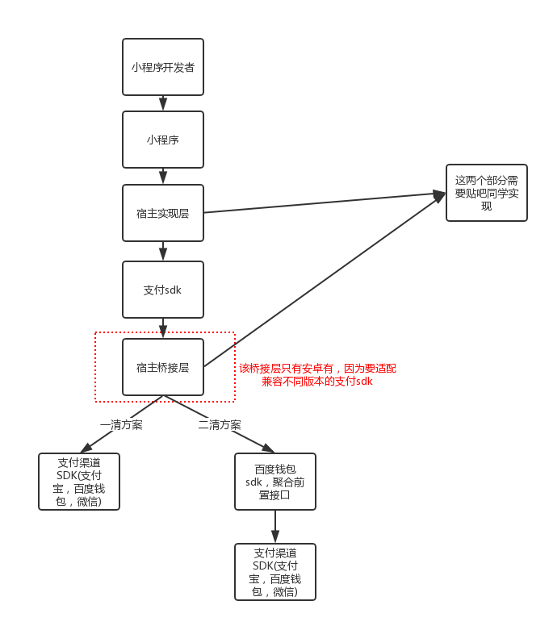

### 一、接入流程梳理
首先看一下设计流程图，简单解释一下流程：
1. 开发者自己生成订单信息
2. 通过小程序前端接口传递给小程序模块
3. 小程序模块将参数透传给宿主（贴吧）
4. 宿主（贴吧）封装参数传递给支付sdk，支付sdk展现渠道对话框，供用户选择支付渠道
5. 支付sdk内部进行网络请求，完成账单生成等操作，最后生成支付渠道对应的支付参数输出出来
6. 宿主（贴吧）拿到支付sdk传递的参数，将这些支付参数传递给对应的支付渠道，完成支付
7. 最后层层透传支付结果

**解释几个可能的疑问**
>目前因为方案是将支付sdk从开源代码中拆分出来，所以首当其冲就要实现小程序与支付sdk之间的实现层逻辑，将开发者传过来的支付订单消息，支付黑名单设置，传递给支付sdk。

>其次是支付桥接层，该层次的职责是将支付sdk处理过的参数传递给对应的渠道sdk，设计该层次的原因有两个：其一是百度app为了控制包体积和动态下发，集成渠道sdk都是采用插件形式，不具有普遍性。其二是支付宝和微信支付sdk都进行过大版本更新，两个版本的sdk代码引用位置发生改变，无法做到开源兼容，故设计桥接层由宿主自行实现

>最后注意一下上图中一清和二清的概念，业务和财务逻辑上暂且不讲，有兴趣可以自己学习一下哈，此处只讲技术方案区别  
一清：支付sdk直接请求支付渠道（微信，支付宝，百度钱包），桥接层代码中三个接口对应不同渠道  
二清：支付sdk将参数传递给钱包sdk,由钱包sdk向不同的支付渠道发去支付请求，桥接层代码中只有一个接口传递给百度钱包sdk，后续请求支付渠道逻辑由钱包sdk进行

### 二、宿主实现层具体代码实现

在```IAiAppPaymentIoc```接口中的```polymerPay```需要宿主进行实现，将该参数传递给支付sdk  
**该步骤需要以下流程：**
1. 集成支付sdk
2. 添加sdk依赖
3. 使用收银台

>完成集成以后，可以在下单页确认订单后调起收银台进行在线支付，参考代码位置：```AiAppsWalletManager```中的```polymerPay```方法
>其中```platformId```和```nativeAppId```两个字段需要贴吧同学替换成自己的，参考百度支付同学先前提供的文档：http://wiki.baidu.com/pages/viewpage.action?pageId=541924335#id-%E3%80%90%E5%B0%8F%E7%A8%8B%E5%BA%8F%E6%8E%A5%E5%85%A5%E6%94%AF%E4%BB%98%E8%83%BD%E5%8A%9B%E3%80%912.%E5%86%85%E9%83%A8%E7%B3%BB%E7%BB%9F%E6%94%B9%E9%80%A0-%E4%B8%80.%E6%96%B0%E5%A2%9E%E5%AD%97%E6%AE%B5nativeAppId%E5%92%8CplatformId

### 三、宿主桥接层具体代码实现
#### 一清支付
一清支付需要实现```IAiAppPolymerPay```中三个支付渠道接口，详情参考接口注释，在对应的接口当中实现微信，支付宝，百度钱包各自官方要求的请求发起的代码实现，其中最重要的订单信息和回调接口已经在入参中实现，只需要调用即可

#### 二清支付
二清支付需要实现```IAiAppPolymerPay```中百度钱包sdk聚合前置接口(聚合前置接口请参考钱包sdk的文档，百度app中使用的插件，逻辑不太一致)，订单参数和回调接口也已经实现，只需要调用即可
>完成以上流程就可以调用支付sdk进行支付测试，目前线上小程序：**小程序官方实例**中的支付就是调用该接口，可以进行测试，每次只需要支付0.01元

> 目前一清方案还没有线上小程序使用，我们这边会提供一个可以测试一清的demo供贴吧同学测试一清接入，后续会提供

> 贴吧目前不支持微信支付，可以端上写死屏蔽该渠道，也可以服务端进行屏蔽，这个问题后续还需要讨论一下哪方来做
>如果对于小程序（小游戏）支付能力感兴趣，想了解更多，可以参考该文档：http://agroup.baidu.com/swandocuments/md/article/1287314
